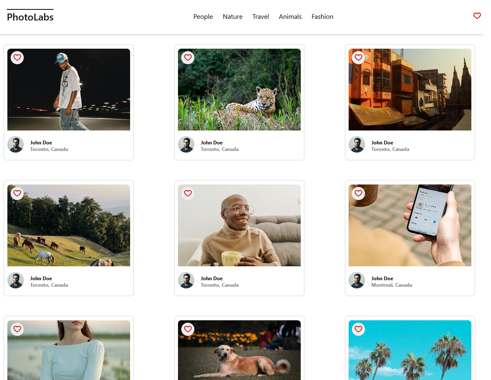

# Photolabs

The PhotoLabs project for the Web Development React course programming. This application has working features including liked photos, topics, and a working modal.

## Final Product

## Setup

[Backend Setup Instructions](/backend/)

[Frontend Setup Instructions](/frontend/)

## Update the api url

Make sure the api url is properly setup on the `.env` file.
`VITE_API_URL=http://localhost:8001/api`